# BAM-RAG

A toy RAG (Retrieval-Augmented Generation) system for learning and experimentation.

## What it does

Scrapes documentation → enriches with LLM → indexes with hybrid search → serves via MCP

```mermaid
flowchart LR
    subgraph scrape["① Scrape"]
        URL[🌐 URL] --> S[Colly]
        S --> MD{".md?"}
        MD -->|yes| RAW[Markdown]
        MD -->|no| HTML[HTML] --> RAW
    end

    subgraph store["② Store"]
        MINIO[(MinIO)]
    end

    subgraph enrich["③ Enrich"]
        ENG[Engine]
        LLM["🤖 Gemma3<br/>tags + summary"]
        EMB["🧮 qwen3<br/>embeddings"]
        ENG <--> LLM
        ENG <--> EMB
    end

    subgraph index["④ Index"]
        ES[("Elasticsearch<br/>BM25 + KNN")]
    end

    subgraph query["⑤ Query"]
        MCP[MCP Server] <--> CLAUDE[Claude]
    end

    RAW --> MINIO --> ENG --> ES <--> MCP
```



## Prerequisites

- **Docker Desktop 4.40+** with Model Runner enabled
- **Go 1.21+**
- **Make**

### Enable Docker Model Runner

1. Open Docker Desktop → Settings → Features in development
2. Enable "Docker Model Runner"
3. Restart Docker Desktop

## Quick Start

```bash
# 1. Full setup (pulls models + starts infrastructure)
make setup

# 2. Update config with your Docker socket path
#    Edit config/config.yaml - set socket_path
#    Mac: ~/.docker/run/docker.sock
#    Linux: /var/run/docker.sock

# 3. Scrape some docs
make scrape URL=https://go.dev/doc/tutorial/getting-started

# 4. Search
make search Q="getting started"

# 5. Start MCP server (for Claude Desktop)
make serve
```

## Available Commands

```bash
make help          # Show all commands
make setup         # Full setup: models + infrastructure
make models        # Pull AI models only
make infra         # Start Elasticsearch + MinIO only
make scrape URL=x  # Scrape and index a URL
make search Q="x"  # Search indexed docs
make serve         # Start MCP server
make test          # Run tests
make build         # Build binary
```

## Stack

- **Go** - single binary, fast
- **Elasticsearch** - hybrid search (BM25 + vectors with RRF)
- **MinIO** - S3-compatible storage between scraper and indexer
- **Docker Model Runner** - local LLM (Gemma3) and embeddings (qwen3)

## Architecture

Event-driven choreography with Go channels—no central orchestrator.


**Key design choices:**
- **S3 checkpoint** — Re-run ingestion without re-scraping
- **Optional enrichment** — Works without LLM/embeddings (graceful degradation)
- **Hybrid search** — BM25 + KNN combined via Reciprocal Rank Fusion (RRF)

## Configuration

Edit `config/config.yaml`:

```yaml
embeddings:
  socket_path: ~/.docker/run/docker.sock  # Your Docker socket

llm:
  socket_path: ~/.docker/run/docker.sock
```

## License

MIT
